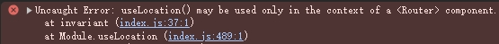

### 如何阻止弹窗关闭？<Badge type="warning">MsModal | MsDrawer | MsConfirm 共性问题 ​</Badge>

onOk 和 onCancel 都是接受一个 promise，只要这个 promise 正常执行完弹窗都会关闭，要阻止关闭就抛 promise 错误。

```tsx
const handler = async () => {
  await Promise.reject();
  // 或者  return Promise.reject();
};

<MsModal onOk={handler} onCancel={handler} />;
```

### 为什么打开弹窗报错？<Badge type="warning">MsModal | MsDrawer | MsConfirm 共性问题 ​</Badge>

调用 `MsModel.open` 时出现下图错误，原因是未声明 `MsConfigProvider` 组件，解决方法请看[前置条件](#前置条件)。


### 为什么在弹窗中使用路由 api 报错？<Badge type="warning">MsModal | MsDrawer | MsConfirm 共性问题 ​</Badge>

调用 `MsModel.open` 时出现下图错误，原因是 `MsConfigProvider` 声明位置错误（常见错误是将其声明在 app.tsx 的 rootContainer 或 innerProvider 中），解决方法请看[前置条件](#前置条件)。



**注意**：组件库中 MsTable、MsInstance、MsTabs 等组件中用到了路由 api，也会引起该问题。
